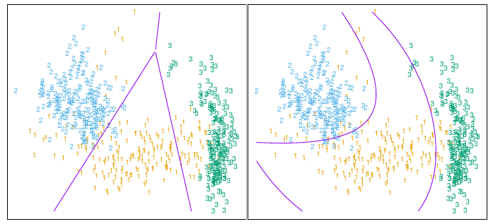

# Introduction
Focus on linear method for classification problem.

1. In chapter2: We see well classified method Decision Boundaries for linear regression

- Suppose there are $K$ classes, for convenience labeled $1, 2, . . . , K$.
- Fitted linear model:$fk(x) = β̂_{k0} + β̂_{k}^{T}x$  (for k indicator)
=> The decision boundary btw $k$ and $l$: ${x : ( β̂_{k0} − β̂_{l0}) + ( β̂_k − β̂_l)^{T}x = 0}$   (affine set or hyper)
=>  [piecewise](https://en.wikipedia.org/wiki/Piecewise) hyperplanar decision boundaries!!!

2. Some method
- _discriminant functions_ $δ_k(x)$ for each class, and then classify x to maximize value!
=> This approach is instant of above:  $δ_k(x)$ = $β̂_{k0} + β̂_{k}^{T}x$ 

- The posterior probabilities $Pr(G = k|X = x)$
=> The decision boudary is set: $\{x|\beta_0 + \beta^T x = 0\}$  

=> In both examle, they differ in the way the linear function is fit to the training data. But the final classify is the same!

How to scale the dicision boundaries, using some `adding variable`!!

#  Linear Regression of an Indicator Matrix

#  Linear Discriminant Analysis

# Logistic Regression

# Separating Hyperplanes

