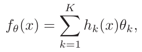
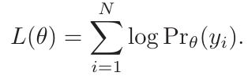

# Linear Models and Least Squares
Classic problem: Given $X^T = (X_1 , X_2 , . . . , X_p )$ , predict: $Ŷ = β̂_0 + \sum_{j=1}^{p} X_{j} β̂_j$. For convinience, treat $β̂_0$ is one of the vector $β̂$, we have: $Ŷ = X^{T}β̂$ 

- The most popular is the _least squares_: We pick the coef $\beta$ to minimize the residual sum of squares!

- It can be view as the matrix form:

Where $X[N*p]$  and $y[N]$.  Differentiating with respect to $β$ we get the normal equations:

$X^T(y − Xβ) = 0$

- If $X^T X$ is a [Nonsingular matrix](https://mathworld.wolfram.com/NonsingularMatrix.html#:~:text=A%20square%20matrix%20that%20is,45), the unique solution:

$β̂ = (X^T X)^{−1} X^T y$

=> At an arbitrary input $x_0$ the prediction is $ŷ(x_0) = x^{T}_{0} β̂$ 

# Statistical Decision Theory
_The world of random variables and probability spaces_
Let define the probem: We have $X ∈ R^p$ (random variable),  $Y ∈ R$ is a real value output. With joint distribution $Pr(X, Y)$. The output function $f(X) = Y$ and the loss function is: $L(Y, f(x))$
Usually we choose the square error loss: $L(Y, f (X)) = (Y − f (X))^2$. 

The expected (squared) prediction error:
       ($E(x) = \int{xdx}$)

By apply the product rule: $Pr(X, Y ) = Pr(Y |X)Pr(X)$ for above equation, we have:

To minimize the $EPE$, we have suffice condition:
$f (x) = argmin_c E_{Y|X} [Y − c]^2 |X = x)$, because $E_X$ is based on input data.
=> $f(x) = E(Y|X=x)$
=> The best prediction of $Y$ at any point $X = x$ is the conditional mean.

_One thing important is everthing can be express by probability theory_

Exemple with k-nearest neighbors and linear regression:
- k-nearest neighbors approximate the $f(x) = Ave(y_i |x_i ∈ N_k (x))$. Where “Ave” denotes average, and $N_k (x)$ is the neighborhood containing the $k$ points in $T$ closest to $x$. For large training, $k/N → 0$ then:
     $f (x) → E(Y |X = x)$ 
     
- linear regression, we have $f(x) ≈ x^T β$ and differentiating we can solve for β theoretically:
    $β = [E(XX^T)]^{−1} E(XY )$

=> So both k-nearest neighbors and least squares end up approximating conditional expectations by averages. But there are different:
- Least squares assumes $f(x)$ is well approximated by a globally linear function.
- k-nearest neighbors assumes $f (x)$ is well approximated by a locally constant function.

# Local Methods in High Dimensions
Quite difficult so I will comback this chapter in another time (right now I'm concentrate to important part!!!)

# Statistical Models, Supervised Learning and Function Approximation
We anticipate using other classes of models for $f(x)$ , in many cases specifically designed to overcome the dimensionality problems, and here we discuss a framework for incorporating them into the prediction problem.

## A Statistical Model for the Joint Distribution $Pr(X, Y )$ 
Suppose in fact that our data arose from a statistical model:
$Y = f (X) + ε$.
Where the random error $ε$ has $E(ε) = 0$ and is independent of $X$.

## Function Approximation
The linear basis expansion:

Where for example h k might be $x_1^2$ , $x_1 x_2^2$ , $cos(x_1)$ and so on. And use the `RSS` (residual sum-of-squares) to estimate the parameters (this method is usally use)

Another choice (_more general_) to estimate is  `maximum likelihood estimation`. Suppose we have a random sample $y_i , i = 1, . . . , N$ from a density $Pr_θ (y)$ indexed by some
parameters $θ$. The log-probability of the observed sample is:
 

=>The principle of maximum likelihood assumes that the most reasonable values for $θ$ are those for which the probability of the observed sample is largest.

# Structured Regression Models
Normal approach can be difficult when come with high dimension => `structured approaches`!
## Difficulty of the Problem

# Classes of Restricted Estimators

## Roughness Penalty and Bayesian Methods

## Kernel Methods and Local Regression

## Basis Functions and Dictionary Methods

#  Model Selection and the Bias–Variance Tradeoff

